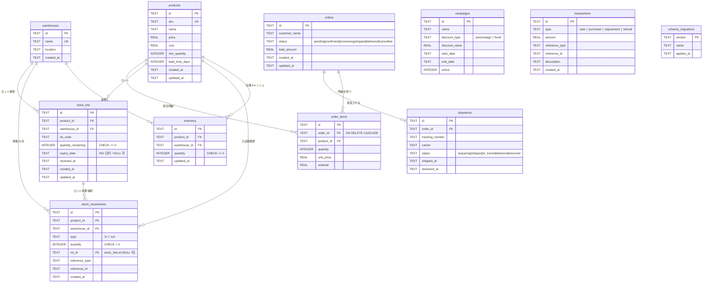
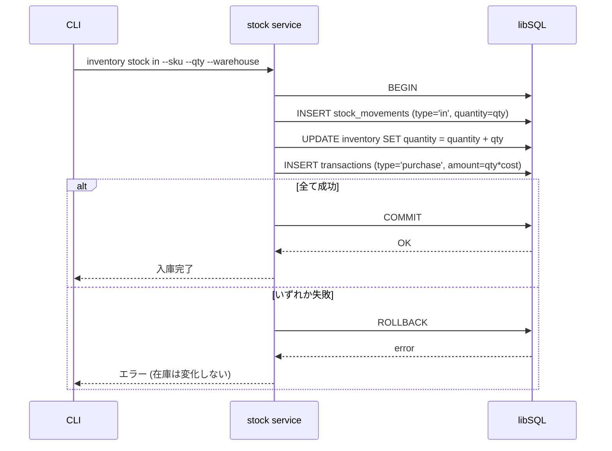
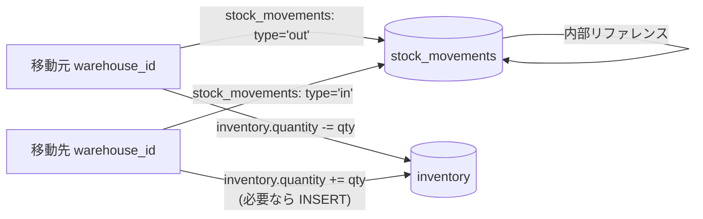
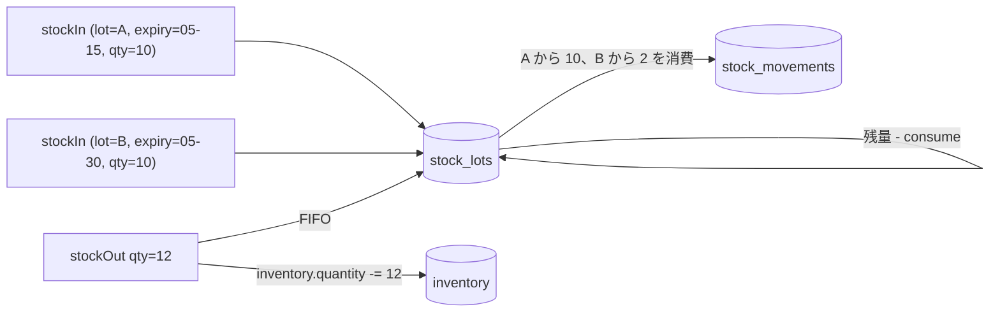
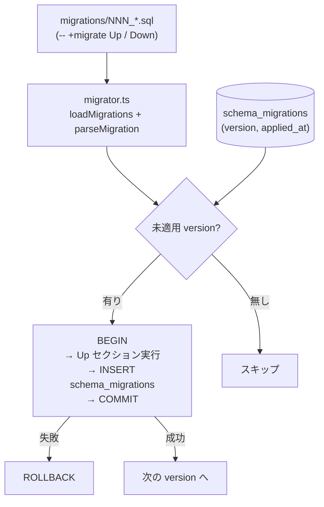

# データベース アーキテクチャ

libSQL (SQLite 互換) を採用。スキーマは `migrations/NNN_<name>.sql` で管理し、適用済みバージョンは `schema_migrations` テーブルに記録される。

## ER 図



> `campaigns` と `transactions` は外部キーを持たず、アプリ層から `reference_type` + `reference_id` で多態的に他テーブルを参照する。`schema_migrations` はマイグレーション基盤のメタテーブル。

## テーブルの責務

| テーブル | 役割 | 備考 |
|---|---|---|
| `products` | 商品マスタ | `sku` で一意。`lead_time_days` は需要予測の安全在庫算出で使用（migration 002）。soft delete 想定の `is_active` 列は将来追加予定 |
| `warehouses` | 倉庫マスタ | `name` で一意 |
| `inventory` | 商品×倉庫ごとの**現在在庫キャッシュ** | `UNIQUE(product_id, warehouse_id)`。`SUM(stock_lots.quantity_remaining)` と一致する |
| `stock_movements` | 入出庫の**追記専用イベントログ** | 各行は 1 ロット分の変動。`lot_id` で `stock_lots` を参照（migration 003 で追加、過去データは NULL） |
| `stock_lots` | ロット単位の在庫（数量・有効期限） | 出庫は `expiry_date` が早いロット → `received_at` が古いロットの順に消費する FIFO |
| `orders` / `order_items` | 受注ヘッダ + 明細 | `order_items.order_id` は `ON DELETE CASCADE` |
| `shipments` | 発送情報 | 1 受注に対して複数の発送を許容 |
| `campaigns` | 割引キャンペーン | 適用ロジックはアプリ層 (`order.applyCampaign`) |
| `transactions` | 会計トランザクション (追記専用) | 売上・購買・調整・返金を統一して記録 |
| `schema_migrations` | マイグレーション履歴 | `migrator.ts` が自動管理 |

## ハイブリッド在庫モデル

`stock_movements` (event log) と `inventory` (cache) の 2 層構造。**全ての在庫変更は単一トランザクション内で 3 テーブルを atomic に更新する**。

### 入庫 (stock in) のシーケンス



### 倉庫間移動 (stock transfer)

移動元で `out`、移動先で `in` の 2 件を**同一トランザクション**に記録。総在庫量は保存される (invariant)。会計トランザクションは生成されない（社内移動のため）。



### キャッシュ整合性の保証

- `inventory.quantity` は **`SUM(stock_movements.quantity * sign(type))`** と一致しなければならない
- かつ `inventory.quantity` = `SUM(stock_lots.quantity_remaining)` （同 product × warehouse 内）
- この不変条件は `tests/modules/stock.property.test.ts` で property-based に検証されている
- 万一ずれた場合は `stock_movements` から `inventory` を再構築可能

## ロット管理と FIFO 出庫

`stock_lots` を中心にロット単位の在庫を追跡する。出庫順は次のキーで決定する:

```
ORDER BY (expiry_date IS NULL), expiry_date ASC, received_at ASC, id ASC
```

つまり「期限が早いロット → 期限がないロットは最後 → 同期限内は入庫順」となる。



- 1 回の `stockOut` が複数ロットにまたがる場合、消費するロット数だけ `stock_movements` 行が `lot_id` 付きで生成される
- `stockTransfer` も FIFO で消費し、移動先には `lot_code` と `expiry_date` を引き継いだ新規ロットを作成する
- 期限切れアラートは `getExpiringLots(daysAhead = 30)` および CLI `inventory stock expiring --days <n>` で取得（期限切れ済みも含む）

## マイグレーション運用フロー



- `migrate up`: 全 pending を順に適用
- `migrate down`: `schema_migrations` の最新行を 1 件だけロールバック
- `migrate status`: ファイル一覧と `schema_migrations` を突き合わせて表示
- `migrate create <name>`: 次の連番でテンプレートファイルを生成
- 起動時の `initDatabase()` は `migrateUp()` を自動呼び出し（テスト互換のため）。本番では明示的に `migrate up` を実行する運用を推奨

## 設計上の前提

- 全テーブルの主キーは `crypto.randomUUID()` の TEXT
- 日時は ISO 8601 形式の TEXT (`datetime('now')` でデフォルト)
- `updated_at` は DB トリガではなくリポジトリ層で明示的に更新
- `stock_movements` と `transactions` は append-only。物理削除しない
- `PRAGMA foreign_keys = ON` を接続時に毎回設定 (SQLite の既定は OFF)
